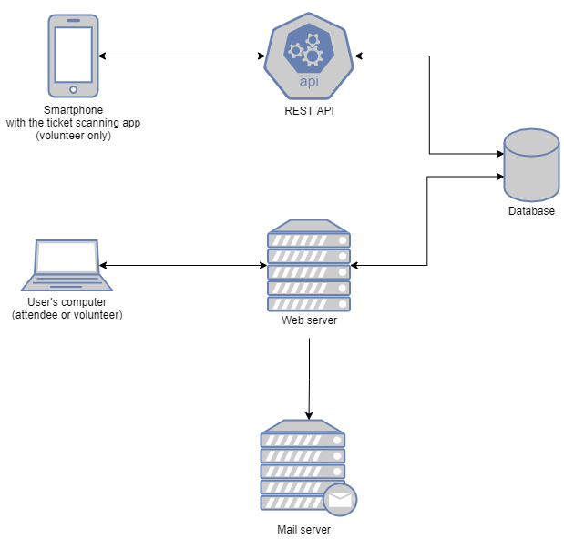
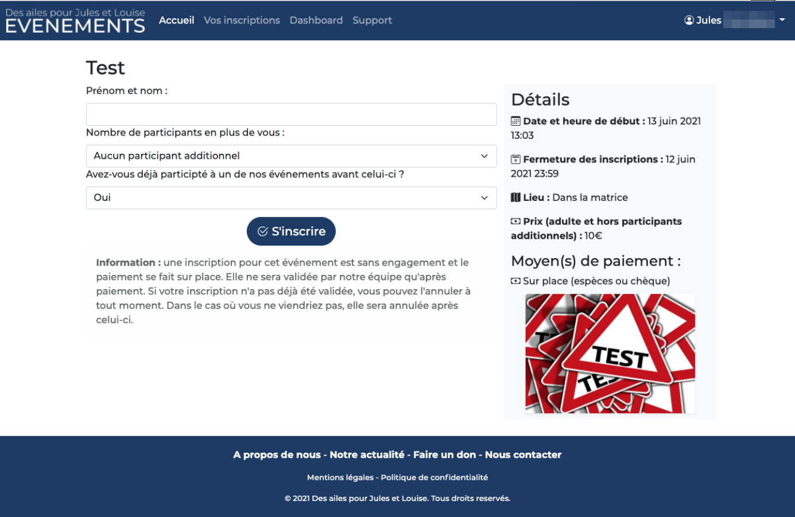
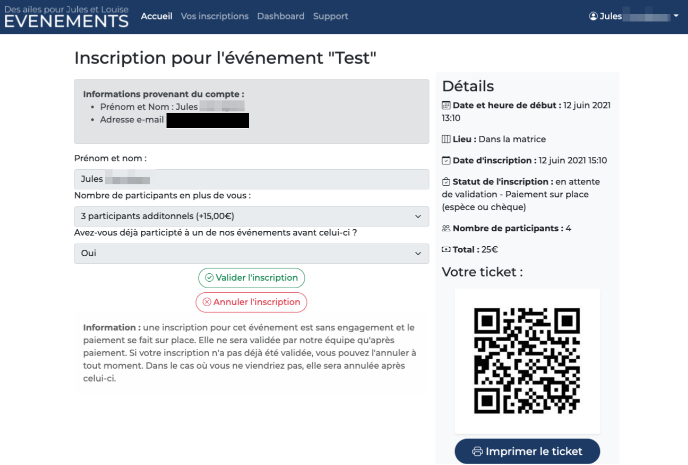

# DAPJL Internship

This GitHub repo contains a short presentation of my internship at the [Des ailes pour Jules et Louise (DAPJL)](https://www.desailespourjulesetlouise.fr) non profit organization, during my second year of Computer Science at the University of Orléans in 2021.

Please note that in the context of the COVID-19 pandemic the DAPJL events schedule was frozen and therefore the deployment of the software components of this project was planned to a later date during the development.

## The project

The main goal of this project was to develop an online registration platform for DAPJL events, using technologies like Java and Play Framework. This platform was created in a context where the organization was using a third party tool which didn't fully suit its needs. This project was an opportunity to switch to a fully organization owned and operated service that can evolve in the future following its needs.

This project was at the end of my internship supplemented by a Flutter mobile app for iOS and Android (and its dedicated Spring Boot REST API) to scan the digital or printed tickets generated by the registration platform. The app also allows the management of the registrations before the event directly from a mobile device.
The latter was initially planed to be developed after my internship but I had the opportunity to integrate this application into my activity as an intern.

### The key aspects

Some key aspects were defined at the very beginning of the project:
- **Ease of use**: to allow as many people as possible to use the service and to encourage its usage instead of doing registrations by calling the DAPJL team.
- **Security**: the platform has been designed to protect as much as possible the  users' accounts and their data, by applying good security practices such as [those of the OWASP](https://cheatsheetseries.owasp.org/) and by being transparent on how their account is used (we send emails for important actions and make use of captchas).
- **Fraud prevention**: to prevent ticket duplication and forgery.
- **Accessibility**: the platform has adopted a design that uses colors that are more readable, especially for people with visual impairments, and a HTML markup that respects W3C standards to make the website compatible with screen readers (and more SEO-friendly by the way!).
- **Operational performance**: the tools built during this internship are meant to reduce the event entrance wait times and the time invested by volunteers in repetitive tasks.
- **Flexibility**: the platform allows the creation of events with custom forms and the integration of other event ticketing service providers.
- **Compatibility with mobile devices**
- **Local regulations compliance**

All these aspects are more detailed in my report, including some diagrams and screenshots.

### Technologies used

#### Programming languages

- Java (website and REST API)
- Dart (ticket scanning mobile app)

#### Frameworks

- Play Framework (website)
- Spring Boot (REST API)
- Flutter (ticket scanning mobile app)
- Bootstrap (website UI)

#### Database Management System

- MariaDB

### Screenshots

Please find a few screenshots taken during the development below:

- Event registration page (the forms are easily customizable at event creation using the staff dashboard): 

  

- The registration details as seen by an authorized member of the team:

  

### What's next?

The website will be made available when DAPJL will resume the organization of the events that need online registration.

Its address will be [evenements.dapjl.org](https://evenements.dapjl.org/).
